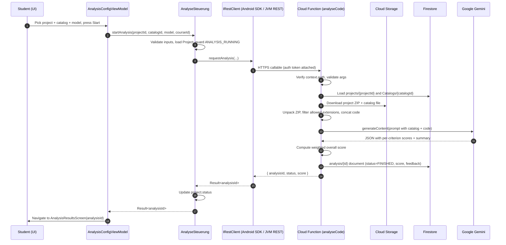

# Architecture

This document describes the architecture of CodeScope at the level a reviewer or technical interviewer might want: what the modules are, where the abstractions sit, where the platform boundary is, how the end-to-end analysis flow works, and how access control is enforced.

For a high-level project description, see the [README](./README.md).

## 1. Overview

CodeScope has two runtime surfaces and one backend:

- A **Kotlin Multiplatform** client built on **Compose Multiplatform**, shipped both as a native Android app and as a Desktop application (Windows / macOS / Linux via the Compose Desktop Gradle plugin).
- A **Firebase Cloud Functions** backend in TypeScript that runs the actual AI analysis. Putting Gemini behind a Cloud Function keeps the model API key off client devices and centralizes the prompt construction.

The deliberate choices behind this shape:

- **Why KMP, not separate codebases.** The product has a small team and two target platforms with effectively the same workflows. Sharing the UI, navigation, view models, and domain logic kept the cost of supporting both platforms reasonable.
- **Why Firebase.** Auth, storage, Firestore, and Cloud Functions in one stack let the team skip writing an operational backend. Firestore's security rules let role-based access live next to the data instead of being duplicated in every client.
- **Why Gemini via a Cloud Function.** The function is the trust boundary: it validates the caller's identity, enforces server-side ownership of inputs, holds the model API key as a Secret Manager–backed secret, and is the single place that constructs the prompt.

## 2. Module map

```
team06/
├── composeApp/                 # KMP client (Android + Desktop)
│   └── src/
│       ├── commonMain/         # Shared UI, view models, controllers, repositories, domain, DI
│       ├── androidMain/        # GitLive Firebase impls, Android Activity, Android Ktor engine
│       └── jvmMain/            # Desktop entry, REST-based Firebase impls, Ktor CIO engine
├── functions/                  # Firebase Cloud Functions (TypeScript)
│   └── src/index.ts            # analyseCode + generateCriteria
├── firestore.rules             # Server-side role-based access rules
└── storage.rules               # Cloud Storage rules
```

The Compose Desktop application is configured in `composeApp/build.gradle.kts` under `compose.desktop { ... }`, with native installer formats (`.dmg`, `.msi`, `.deb`), a macOS bundle ID, and platform-specific icons.

`BuildKonfig` (configured in the same Gradle file) reads keys out of `local.properties` and exposes them as compile-time constants — `DESKTOP_CLIENT_ID`, `DESKTOP_CLIENT_SECRET`, `FIREBASE_API_KEY`, `FIREBASE_PROJECT_ID`, `FIREBASE_STORAGE_BUCKET`, `FIREBASE_FUNCTIONS_REGION`. There is no runtime config file.

## 3. Layered architecture in `commonMain`

`composeApp/src/commonMain/kotlin/de/thkoeln/codescope/` is organized as a clean-ish layered architecture. Higher layers depend only on lower ones, never the other way around.

### `screens/` — Composables

One file per screen, each rendering Compose UI and binding to a view model:

- `LoginScreen.kt`
- `DashboardStudentScreen.kt`, `DashboardTeacherScreen.kt`
- `CourseManagementScreen.kt`, `CourseStudentScreen.kt`
- `CourseDetailStudentScreen.kt`, `CourseDetailTeacherScreen.kt`
- `CriteriaManagementScreen.kt`
- `ProjectUploadScreen.kt`
- `AnalysisConfigScreen.kt`, `AnalysisResultsScreen.kt`
- `AssessmentManagementScreen.kt`
- `AdminPanelScreen.kt`
- `SettingsScreen.kt`

### `viewmodel/` — state holders

One view model per screen, holding UI state and forwarding intents to the logic layer. Examples: `LoginViewModel`, `AnalysisConfigViewModel`, `AnalysisResultsViewModel`, `DashboardViewModel`, `DashboardTeacherViewModel`, `CriteriaManagementViewModel`, `ProjectUploadViewModel`, `AdminPanelViewModel`, `AssessmentManagementViewModel`, `CourseDetailStudentViewModel`, `CourseDetailTeacherViewModel`, `CourseManagementViewModel`, `CourseStudentViewModel`, `SettingsViewModel`, and a top-level `AppViewModel`.

### `logic/` — controllers (`*Steuerung`)

The orchestration layer. Each controller has an interface (`I*Steuerung`) and an implementation. They are pure orchestration: validate inputs, call repositories and clients, map results — no UI, no platform code.

- `LoginSteuerung` — auth flow
- `ProjektSteuerung` — upload, list, delete student projects
- `KriterienkatalogSteuerung` — CRUD on criteria catalogs, import/export
- `AnalyseSteuerung` — kick off an analysis, read results, aggregate analyses across an instructor's courses
- `DozentKursSteuerung`, `StudentKursSteuerung` — course management from the two role perspectives
- `AdminSteuerung` — user/role management
- `KISteuerung` — AI helper actions (e.g. generating criteria suggestions)
- `ProjektStorage`, `NotificationServiceImpl` (in platform source sets)

Example signature, from `AnalyseSteuerung`:

```kotlin
override suspend fun startAnalysis(
    projectId: String,
    catalogId: String,
    model: String,
    courseId: String?,
): Result<String>
```

Inputs are validated, the project is loaded via the repository, status transitions are guarded (`ANALYSIS_RUNNING`), and the call is delegated to `IRestClient.requestAnalysis(...)`, which on Android calls the Cloud Function via the GitLive SDK and on JVM calls it via a Ktor REST request.

### `data/repository/` — domain repositories (`*Verwaltung`)

Interfaces + implementations that present the domain to the controllers without leaking Firestore types:

- `IBenutzerVerwaltung` / `BenutzerVerwaltungImpl` — users
- `IKursVerwaltung` / `KursVerwaltungImpl` — courses
- `IProjektVerwaltung` / `ProjektVerwaltungImpl` — projects
- `IAnalyseVerwaltung` / `AnalyseVerwaltungImpl` — analyses
- `IKriterienKatalogVerwaltung` / `KriterienKatalogVerwaltungImpl` — criteria catalogs
- `ISettingsRepository` — platform-specific (impl lives in `androidMain` and `jvmMain`)

These talk to the client layer.

### `data/client/` — platform-spanning client interfaces

This is the `expect/actual` boundary for everything that touches Firebase:

- `IFirestoreClient` — typed Firestore reads/writes
- `IAuthProvider` — sign-in / token management
- `IFirebaseStorageClient` — uploads and downloads
- `IRestClient` — calls to Cloud Functions
- `GoogleAuth.kt` and `FirebaseJvmConfig.kt` — shared auth helpers / JVM-only config

The interfaces live in `commonMain`; their implementations live in `androidMain` and `jvmMain`. See §4 for why.

### `domain/` — entities

Plain data classes grouped by feature, used by every layer above:

- `ai/AiModel.kt`
- `analysis/AnalysisResult.kt`
- `course/Course.kt`
- `criteria/CriteriaCatalog.kt`
- `googleAuth/DriveFile.kt`, `googleAuth/GoogleAuthCredential.kt`
- `project/Project.kt`
- `user/User.kt`

### `di/` — Koin modules

`AppModule.kt` wires controllers and repositories. `PlatformModule.kt` is `expect`ed in commonMain and `actual`ized in each platform source set (`PlatformModule.android.kt`, `PlatformModule.jvm.kt`) to bind the right concrete clients.

## 4. The KMP split for Firebase

This is the most interesting architectural piece in the project and was the main thing the author of this fork (Maximilian Ehling) worked on.

The GitLive Firebase SDK gives you a single multiplatform Firebase API surface and works well on Android, but its JVM target is not reliable for serious use — in particular, Firestore and Auth do not behave like their native counterparts on Desktop. Rather than constrain the product to Android, the project keeps both targets and **abstracts Firebase behind a small set of interfaces in `commonMain`**, then provides two completely different implementations:

```
                    commonMain
                        |
        +---------------+----------------+
        |   IFirestoreClient             |
        |   IAuthProvider                |
        |   IFirebaseStorageClient       |
        |   IRestClient                  |
        +---------------+----------------+
                |                |
            androidMain       jvmMain
                |                |
   GitLive Firebase SDK    Firebase REST API
   (Auth, Firestore,       over Ktor CIO
    Storage, Functions)    (Auth, Firestore,
                           Storage, Functions)
```

The Android implementations live in `composeApp/src/androidMain/kotlin/de/thkoeln/codescope/data/client/`:

- `FirestoreClientImpl.kt`
- `AuthProviderImpl.kt`
- `FirebaseStorageClientImpl.kt`
- `RestClientImpl.kt`
- `GoogleAuth.android.kt`

The JVM implementations live in `composeApp/src/jvmMain/kotlin/de/thkoeln/codescope/data/client/`:

- `FirestoreClientImpl.kt` — talks to the Firestore REST API
- `AuthProviderImpl.kt` — signInWithPassword / token refresh against `identitytoolkit.googleapis.com`, plus an OAuth flow for Google sign-in
- `FirebaseStorageClientImpl.jvm.kt` — uploads/downloads against the Storage REST API
- `RestClientImpl.jvm.kt` — calls callable Cloud Functions over HTTPS
- `GoogleAuth.jvm.kt` — local-loopback OAuth handshake

On JVM, all of this is built on **Ktor with the CIO engine** plus `kotlinx.serialization` for JSON. On Android, the GitLive SDK is used directly, which under the hood uses the official Firebase Android SDKs.

Because every consumer above this layer (`*Verwaltung` repositories, `*Steuerung` controllers) only depends on the interfaces, none of them know whether they are running against the SDK or against REST. Adding a new feature means writing it once in `commonMain` and twice in the client layer.

## 5. End-to-end analysis flow

The most representative end-to-end path is "student kicks off a code analysis":



Implementations:

- UI: `composeApp/src/commonMain/kotlin/de/thkoeln/codescope/screens/AnalysisConfigScreen.kt`
- State: `composeApp/src/commonMain/kotlin/de/thkoeln/codescope/viewmodel/AnalysisConfigViewModel.kt`
- Orchestration: `composeApp/src/commonMain/kotlin/de/thkoeln/codescope/logic/AnalyseSteuerung.kt`
- REST/SDK wiring: `composeApp/src/jvmMain/.../RestClientImpl.jvm.kt` and `composeApp/src/androidMain/.../RestClientImpl.kt`
- Backend: `functions/src/index.ts` (`analyseCode`)

A second cloud function, `generateCriteria`, mirrors this pattern for AI-assisted criteria catalog creation.

## 6. Security

Server-side rules in `firestore.rules` are the source of truth — clients enforce the same constraints in UI flows, but the rules are what actually gate the data.

Helpers in `firestore.rules`:

- `isSignedIn()` — `request.auth != null`
- `userExists()` — there is a `/users/{uid}` document for the caller
- `isActive()` — signed-in, profile exists, and `isActive` is either missing or `true`. Deactivated accounts cannot mutate data.
- `isOwner(userId)` — active and `request.auth.uid == userId`
- `hasRole('LECTURER')`, `hasRole('ADMIN')`
- `isLecturer()`, `isAdmin()`, `isStaff()` (lecturer or admin)

Per-collection summary:

- `users/{userId}` — any signed-in user can read (so deactivated users can render a "deactivated" screen). Self-create. Owners can update their own profile only if they do **not** change `role` or `isActive` themselves; admins can update anything. Only admins can delete.
- `courses/{courseId}` — read for active users. Only staff can create/update/delete. Active non-staff users can only update `memberIds` (used for course self-enrollment).
- `projects/{projectId}` — read/update/delete by the owning student or any staff. Create requires `ownerId == auth.uid`.
- `analysis/{analysisId}` — read by the owning user or staff. Create requires `userId == auth.uid`. Staff and owner can update/delete (this is what allows lecturer overrides).
- `Catalogs/{catalogId}` — read for active users, anyone active can create, only staff or owner can mutate.

Cloud Functions add a second layer: `analyseCode` and `generateCriteria` both check `context.auth` and throw `unauthenticated` if absent, and `analyseCode` independently re-derives ownership from the `projects/{projectId}` document rather than trusting the client-supplied `targetUserId` when it can.

## 7. Data model

The Firestore collections used:

- **`users`** — user profile. Notable fields: `role` (`STUDENT` / `LECTURER` / `ADMIN`), `isActive`. The role/isActive fields are administratively controlled; users cannot change them on themselves.
- **`courses`** — a lecturer-owned course with `memberIds` for enrolled students.
- **`projects`** — a student-submitted project. `ownerId` is the student UID. `sourceLocation` is the Cloud Storage path of the uploaded ZIP.
- **`analysis`** — the result of one analysis run. Stores `projectId`, `userId` (the student), optional `courseId`, `criteriaCatalogId`, the `model` used, `status`, the weighted overall `score`, the array of per-criterion `feedback` items (id, criterion text, comment, rating, weight), an LLM `summary`, and timestamps.
- **`Catalogs`** — a criteria catalog. Notable fields: `ownerId`, `sourceLocation` (the catalog file in Storage). The capitalized collection name is preserved deliberately for compatibility with existing documents.

Cloud Storage holds the binary artifacts referenced from `projects.sourceLocation` and `Catalogs.sourceLocation`. Storage access is governed by `storage.rules`.
