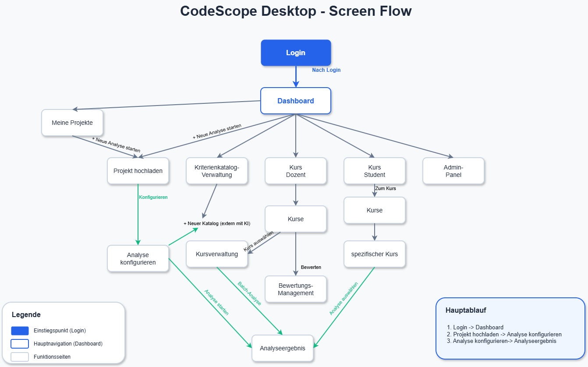
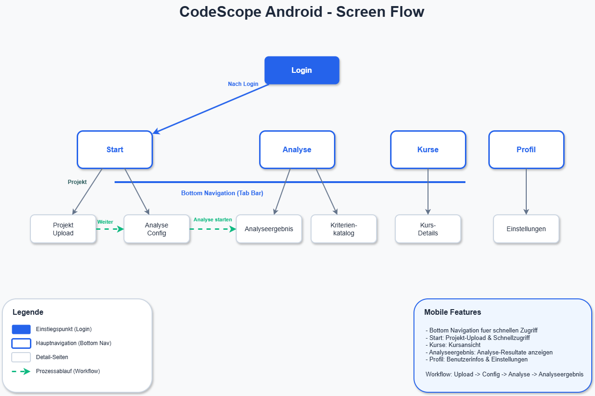

# CodeScope — Project Documentation

This folder holds the engineering documentation that was produced alongside the CodeScope app as part of the original university group project (TH Köln, course SYP25, winter term 2025/2026). The documents are written in **AsciiDoc** (GitHub renders them natively when you click in) and are in **German**, matching the language of the course they were delivered for. Some PlantUML diagrams are inlined as source blocks and won't render visually on GitHub — they're included so reviewers can see how the system was modelled, not as a polished publication.

A small number of original wiki pages have been **deliberately omitted** from this fork:

- `system/02_spezifikation/03_schnittstellen.asciidoc` and `system/04_benutzer/03_benutzung.asciidoc` overlap heavily with the screenshots in the top-level [README](../README.md) and were left out to avoid duplication.
- `projekt/` (timeline, responsibility assignments, test protocol) and `alldocs.asciidoc` are team-internal records that named individual contributors and are not part of this public fork.

## Visual flows

<table>
  <tr>
    <td width="65%"> <b>Desktop screen flow</b> — entry through login, hub at the dashboard, role-dependent branches into project upload, criteria management, course views, and the admin panel.</td>
    <td width="35%"> <b>Android screen flow</b> — bottom-tab navigation across Start, Analyse, Kurse, Profil, mirroring the desktop workflow on a smaller surface.</td>
  </tr>
</table>

## Contents

### 1. [Anforderungen](./system/01_anforderungen/) — Requirements

Classic "Lastenheft"-style requirements engineering. What the system has to do, who uses it, under what constraints.

- [01 Übersicht](./system/01_anforderungen/01_uebersicht.asciidoc) — Problem statement and scope
- [02 Akteure](./system/01_anforderungen/02_akteure.asciidoc) — Roles: student, lecturer, admin
- [03 Anwendungsfälle](./system/01_anforderungen/03_anwendungsfaelle.asciidoc) — Use cases (the longest single doc)
- [04 Daten](./system/01_anforderungen/04_daten.asciidoc) — Data inventory
- [05 Qualitätsanforderungen](./system/01_anforderungen/05_qualitaetsanforderungen.asciidoc) — Quality attributes
- [06 Randbedingungen](./system/01_anforderungen/06_randbedingungen.asciidoc) — Constraints

### 2. [Spezifikation](./system/02_spezifikation/) — Specification

How the system actually does what the requirements ask for.

- [01 Datenschema](./system/02_spezifikation/01_datenschema.asciidoc) — Firestore collections, fields, relations
- [02 Verhalten](./system/02_spezifikation/02_verhalten.asciidoc) — Behavioural specs / state transitions

### 3. [Architektur](./system/03_architektur/) — Architecture

The most portfolio-relevant section. Context view, component view, runtime view, and deployment view in the spirit of arc42.

- [01 Kontext](./system/03_architektur/01_kontext.asciidoc) — External systems and actors
- [02 Komponenten](./system/03_architektur/02_komponenten.asciidoc) — Internal component breakdown
- [03 Laufzeitsicht](./system/03_architektur/03_laufzeitsicht.asciidoc) — Sequence diagrams for the main flows (the longest doc in the set)
- [04 Verteilung](./system/03_architektur/04_verteilung.asciidoc) — Deployment view

For the English-language architectural summary intended for reviewers, see the top-level [ARCHITECTURE.md](../ARCHITECTURE.md).

### 4. [Benutzer](./system/04_benutzer/) — Operations & developer guide

- [01 Installation](./system/04_benutzer/01_installation.asciidoc) — Setup
- [02 Administration](./system/04_benutzer/02_administration.asciidoc) — Admin operations
- [04 Entwicklung](./system/04_benutzer/04_entwicklung.asciidoc) — Developer onboarding

## A note on rendering

GitHub renders AsciiDoc files in-browser, including most formatting and tables. PlantUML blocks (`[plantuml, ...]`) appear as source code rather than diagrams — GitHub does not run a PlantUML renderer. If you want the rendered output, you can paste the block into [the PlantUML web server](https://www.plantuml.com/plantuml/uml/) or run `asciidoctor` locally with the `asciidoctor-diagram` extension.
